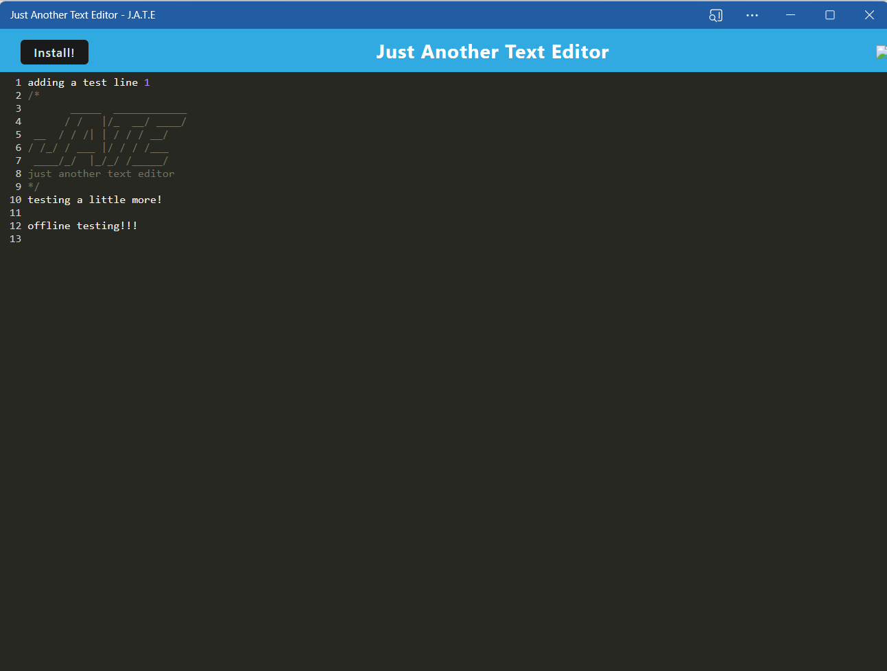

# **Just Another Text Editor (JATE)**

  [](https://opensource.org/licenses/MIT)

  ## **Description**
  **Just Another Text Editor** is a Progressive Web Applications (PWA). This single-page application features a number of data persistence techniques that serve as redundancy in case one of the options is not supported by the browser, getting and storing data to an IndexedDB database. The full-stack application functions offline and is deployed to Heroku.

  ## **Table of Contents:**
  * [Technology Used](#technology-used)
  * [Installation](#installation)
  * [Screenshot of app](#screenshot-of-app) 
  * [Link to deployed app](#link-to-deployed-app)
  * [Usage](#usage)
  * [Credits](#credits)
  * [Contribute](#contribute)
  * [License](#license)
  * [Repository](#repository)
  * [Questions](#questions)

  ## **Technology Used**
  This text editor is a single-page application that meets the **Progressive Web Applications (PWA)** criteria. The app gets and stores data to an **IndexedDB database**. It uses a package called `idb`, which is a lightweight wrapper around the IndexedDB API.

  ## **Installation**
  To download the source code for this app, clone the [Text Editor GitHub repo](https://github.com/DonnaThompson7/Text-Editor), then to start the app, on the command line, run `npm install`. This will create the node_modules directory in your current directory (if one doesnt exist yet) and will download the package to that directory. You can check to see if you already have node.js installed by running either the npm -v or the npm version command. Note:If there is no package.jsonfile in the local directory, the latest version of the package is installed. Then run `npm start`.

  ## **Screenshot of app**
 
  

  ## **Link to deployed app**
 [Link to Text Editor deployed via Heroku](https://murmuring-temple-52779-b0086875758f.herokuapp.com/)
 
  ## **Usage**
```md
AS A developer
I WANT to create notes or code snippets with or without an internet connection
SO THAT I can reliably retrieve them for later use
```

```md
GIVEN a text editor web application
WHEN I open my application in my editor
THEN I should see a client server folder structure
WHEN I run `npm run start` from the root directory
THEN I find that my application should start up the backend and serve the client
WHEN I run the text editor application from my terminal
THEN I find that my JavaScript files have been bundled using webpack
WHEN I run my webpack plugins
THEN I find that I have a generated HTML file, service worker, and a manifest file
WHEN I use next-gen JavaScript in my application
THEN I find that the text editor still functions in the browser without errors
WHEN I open the text editor
THEN I find that IndexedDB has immediately created a database storage
WHEN I enter content and subsequently click off of the DOM window
THEN I find that the content in the text editor has been saved with IndexedDB
WHEN I reopen the text editor after closing it
THEN I find that the content in the text editor has been retrieved from our IndexedDB
WHEN I click on the Install button
THEN I download my web application as an icon on my desktop
WHEN I load my web application
THEN I should have a registered service worker using workbox
WHEN I register a service worker
THEN I should have my static assets pre cached upon loading along with subsequent pages and static assets
WHEN I deploy to Heroku
THEN I should have proper build scripts for a webpack application
```

  ## **Credits**
  Donna Thompson, developer

  ## **Contribute**
  If you would like to contribute to this app, please follow the guidelines of The Contributor Covenant (found here https://www.contributor-covenant.org/version/2/1/code_of_conduct/ ). Submit contributions to the email below.

  ## **License**
Licensed under [The MIT License](https://opensource.org/licenses/MIT).

  ## **Repository** 
  [Repo: github.com/DonnaThompson7/Text-Editor](https://github.com/DonnaThompson7/Text-Editor)

  ## **Questions**
  Please visit my GitHub profile at https://github.com/https://github.com/DonnaThompson7 <br /> Contact me at dlthompson7@icloud.com to report issues, contribute, or if you have additional questions.
